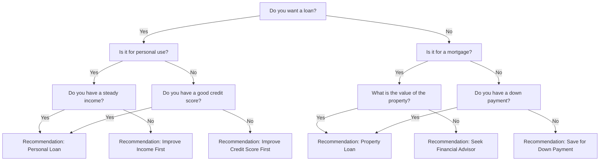

# BT_Decision_Support_System

```mermaid
graph TD
    A[Do you want a loan?] -->|Yes| B[Is it for personal use?]
    A -->|No| C[Is it for a mortgage?]

    B -->|Yes| D[Do you have a steady income?]
    B -->|No| E[Do you have a good credit score?]

    C -->|Yes| F[What is the value of the property?]
    C -->|No| G[Do you have a down payment?]

    D -->|Yes| H[Recommendation: Personal Loan]
    D -->|No| I[Recommendation: Improve Income First]

    E -->|Yes| H
    E -->|No| J[Recommendation: Improve Credit Score First]

    F -->|Yes| K[Recommendation: Property Loan]
    F -->|No| L[Recommendation: Seek Financial Advisor]

    G -->|Yes| K
    G -->|No| M[Recommendation: Save for Down Payment]
```
